# Tema 2. Introducción a Scratch

## A. ¿Que es Scratch?

Scratch es un lenguaje de programación que facilita la creación y desarrollo de historias interactivas, juegos y animaciones. Además, permite la posibilidad de compartir los proyectos que hemos creado con otros usuarios.

Fue desarrollado por un grupo de investigadores del Lifelong Kindergarten Group del Laboratorio de Medios del MIT, bajo la dirección del Dr. Mitchel Resnick.
Scratch busca hacer que la programación sea más atractiva y accesible para todo aquel que se enfrente por primera vez a aprender a programar. Según sus creadores, fue diseñado como medio de expresión para ayudar a niños y jóvenes a expresar sus ideas de forma creativa, al tiempo que desarrollan habilidades tanto de pensamiento lógico, como de aprendizaje para el Siglo XXI.

Podemos usar Scratch para: crear fácilmente historias animadas recrear escenas históricas y hábitats naturales
fomentar la creatividad ya que se pueden crean juegos propios, originales y personalizados elaborar animaciones con objetos previamente obtenidos o bien elaborados por nosotros mismos compartir ideas y proyectos con la comunidad a través de internet resolver retos y/o situaciones problemáticas con animaciones.

Para acceder a Scratch nos dirigimos a su web oficial: [Web de Scratch](http://scratch.mit.edu/)  

A continuación nos encontraremos con una pantalla similar a esta:

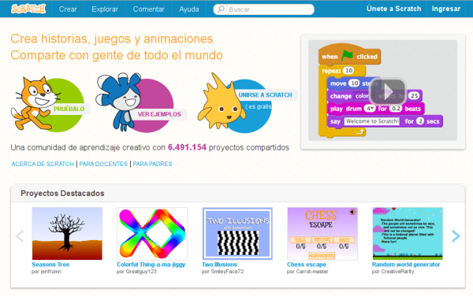

Tenemos dos opciones:  

a. Podemos descargarnos el programa para nuestro equipo, teniendo en cuenta el sistema operativo
que tenemos. (Hay un apartado en el que se explica el proceso de descarga y de instalación).

b. La otra opción es usar el editor online. Tenemos dos posibilidades, usarlo sin registrarnos o
registrarnos y crearnos un usuario, con lo que podemos guardar y compartir nuestros proyectos.
Podemos hacerlo pulsando Únete a Scratch, en la esquina superior derecha de la página.

Al hacer clic en ella, nos aparece la siguiente ventana :

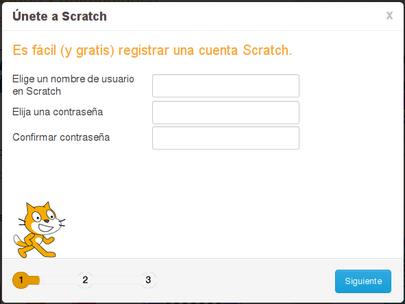  
Después de rellenar todos los datos, tendremos nuestra cuenta de usuario y podemos comenzar a crear proyectos. Para ello, pulsaremos sobre Crear, en la esquina superior izquierda de la pantalla:

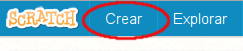

Nos aparecerá la interfaz principal de Scratch :

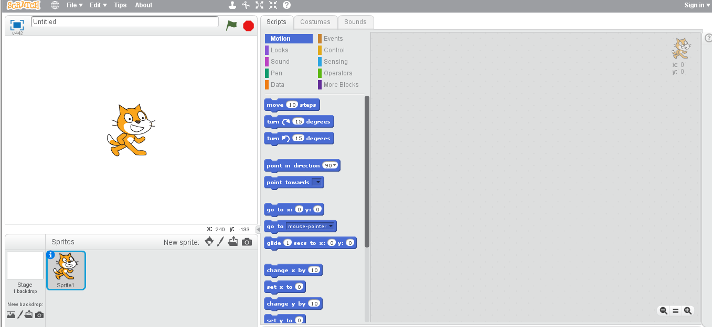  

Lo primero que vamos a hacer es cambiar el idioma, que por defecto aparecerá en ingles.
Para ello, pulsamos sobre la bola del mundo que nos aparece en la parte superior izquierda del menú principal y seleccionamos el idioma deseado:

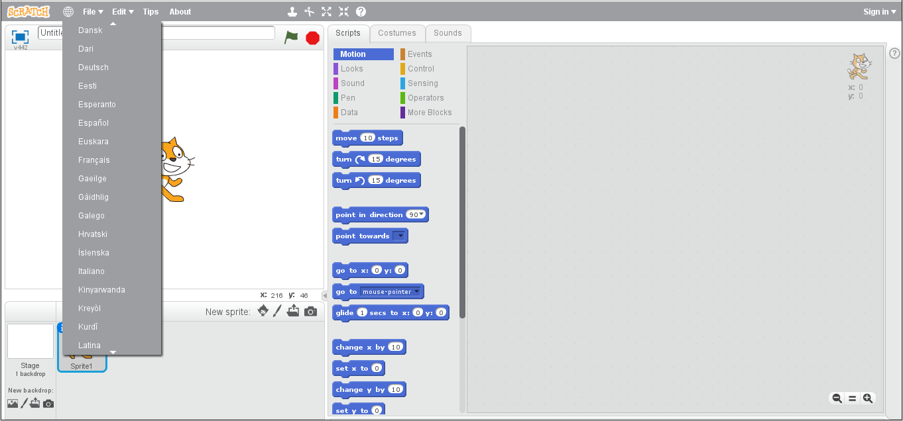  

## Entorno de trabajo

Antes de crear nuestro primer programa con Scratch es necesario conocer las áreas del entorno de trabajo.

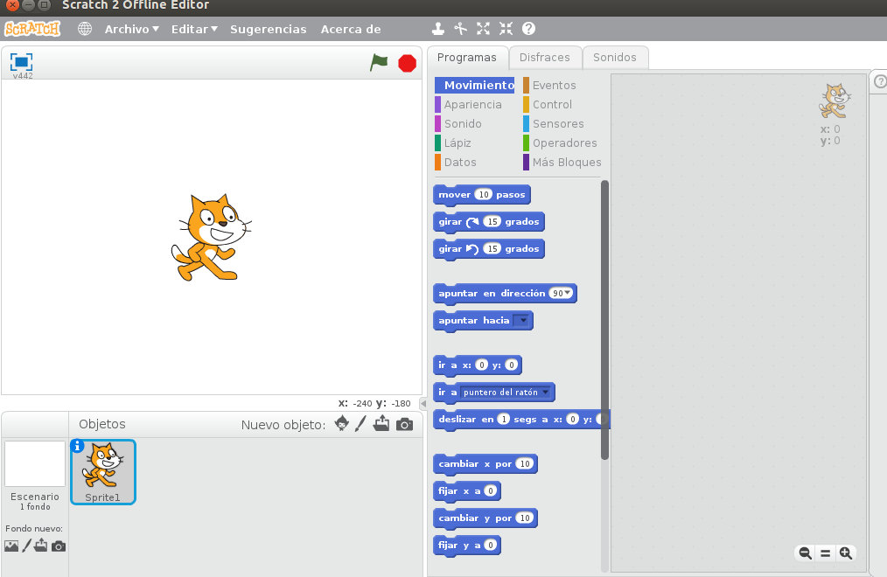  

En la pantalla de Scrath podemos ver diferentes partes:

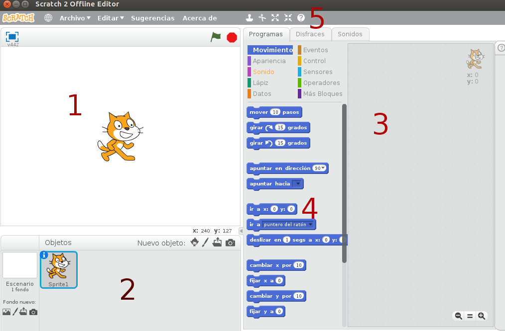  

1. Área de escenario y visualización de programa.
2. Lista de escenario y objetos incluidos en un programa.
3. Área de edición de programas, disfraces y sonidos del objeto activo.
4. Área de familias de bloques.
5. Barra superior de menú de herramientas.

1 ** Barra menu superior **
===========================

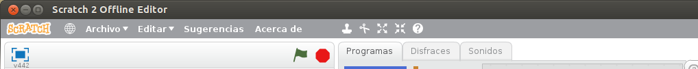  

A. Podemos modificar el idioma por defecto de todo el entorno de trabajo.

B. Guardar el proyecto en el que estamos trabajando.

C. Permite compartir el proyecto que estamos realizando en internet. Para poder compartir es necesario tener un usuario creado en la página oficial de Scratch como se explico en el principio del tema.

D. Menú archivo, donde estan las opciones básicas del proyecto.

E. Menú editar, donde están las opciones básicas de edición del proyecto.

F. Menú compartir, donde están las opciones básicas de compartir del proyecto.

G. Menú ayuda donde están las opciones básicas de ayuda del proyecto.

2 **Área de familias de bloques**
===========================
  
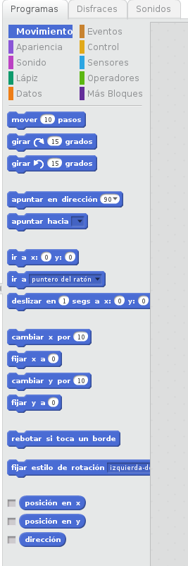  

En parte superior aparecen las 10 familias de bloques existentes:

1. Movimiento
2. Apariencia
3. Sonido
4. Lápiz
5. Datos
6. Eventos
7. Control
8. Sensores
9. Operadores
10. Más bloques

Dependiendo de las necesidades o del programa que vayamos a realizar tendremos un conjunto de bloques disponibles. Estos bloques se irán explicando en lecciones posteriores.

## Edición de programas,disfraces y sonidos

Si pulsamos con el botón derecho del ratón podemos ver toda la información relativa al objeto que estamos seleccionando.

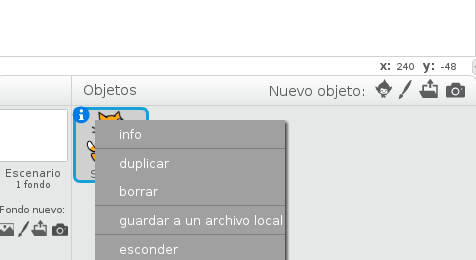  

Nos da información sobre el estilo de rotación:

1. Rotar: El objeto gira cuando cambia la dirección.
2. Izquierda-Derecha: El objeto solo mira a izquierda y derecha.
3. Sin rotación: El objeto nunca gira aunque cambie la dirección.

Nombre del objeto: Nos da el nombre del objeto que tenemos seleccionado.

Posición: Indica la posición X e Y en pantalla.

Dirección: Dirección del objeto en grados.

Programas:
--
Muestra toda la información sobre los programas asociados al objeto activo.

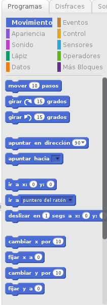  

Los bloques los vamos arrastrando para crear los programas.

Disfraces:
--
Sirve para visualizar y editar los disfraces asociados con el objeto.
Podemos tener el número de disfraces que queramos para cada objeto.

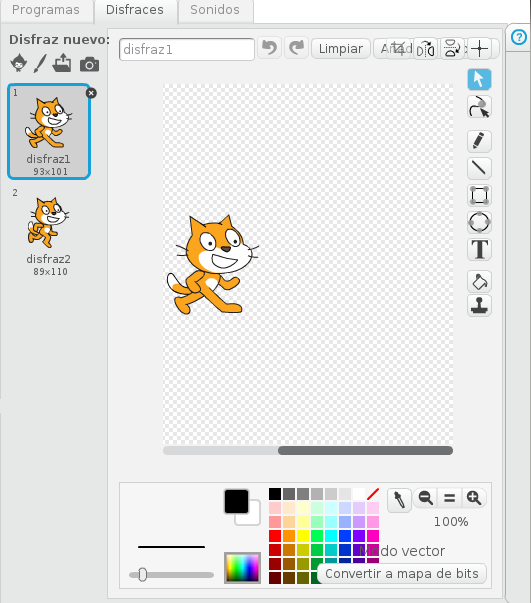  

Es importante saber que el disfraz que se encuentra enmarcado en azul es el disfraz que estamos usando,es decir, es el disfraz activo.

También podemos modificar los disfraces, para añadir o quitar lo que queramos.

Podemos:

- Pintar: Crear el disfraz que mas nos guste, con el editor de Scrath.
- Importar: Crear un nuevo disfraz a partir de un fichero de imagen.
- Cámara: Crear disfraces con las fotos que tomamos con la webcam.

Sonidos:
---
En este apartado vemos los sonidos asociados a cada objeto. Podemos tener tantos sonidos como queramos asociados a un objeto.

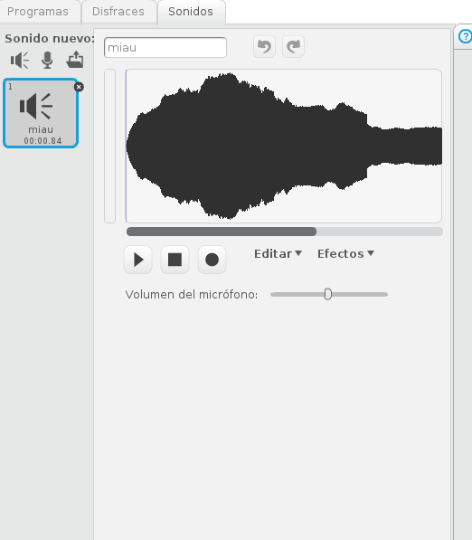  

* Grabar: Creamos un nuevo sonido grabandolo con el micrófono.
* Importar: Creamos un nuevo sonido a partir de un fichero. Scrath puede reproducir formatos de tipo MP3, WAV, AIF y AU.

## 3 Escenario y visualización del programa

Se divide en varias zonas:

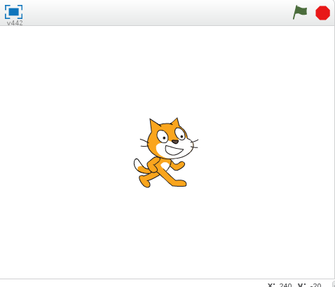  

** Barra de herramientas:**

 Seleccionamos la acción que deseamos y a continuación sobre el objeto que deseamos.

 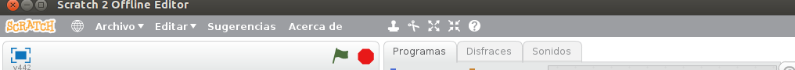  

  * Duplicar: Objetos, disfraces, sonidos y bloques.
  * Borrar: Objetos, disfraces, sonidos y bloques.
  * Aumentar: Hace el objeto más grande.
  * Disminuir: Hace el objeto mas pequeño.

**  Previsualización: **

Modifica el modo de visualización del entorno de Scrath.

Tenemos distintos modos: Previsualización en área grande, en área pequeña y modo de presentación.

  

** Bandera verde: ** Nos sirve para iniciar las creaciones que realizamos con Scrath.

** Circulo rojo: **  Detiene la ejecución de todos los programas.

** Escenario **

Es donde visualizamos las creaciones que realizamos en Scrath.

##### Taller de Introducción a Scratch
#####  OpenXXI S.C.
